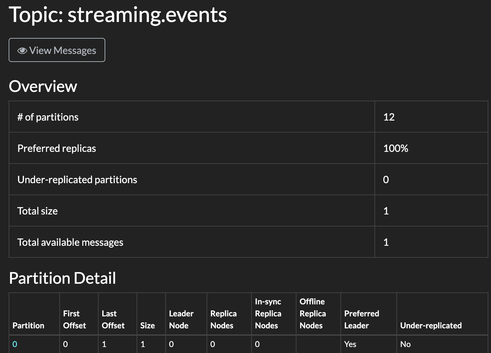

# BrodSample

## Kafka
For this, we assume you have Kafka up and running at `localhost:9092`

I'm using this docker-compose: `https://github.com/obsidiandynamics/kafdrop/blob/master/docker-compose/kafka-kafdrop/docker-compose.yaml` to have Kafdrop running and be able to create topics through a UI on `localhost:9000`

Using Kafdrop I created a topic called `streaming.events` with 12 partitions

## Dependency
First thing you'll need is to add brod to your dependencies
To find the latest version published on hex, run: `mix hex.search brod`

As of writing this, the output was:
```
➜  brod_sample git:(master) ✗ mix hex.search brod
Package                 Description                                            Version  URL                                             
brod                    Apache Kafka Erlang client library                     3.10.0   https://hex.pm/packages/brod  
```

Now just add it to your deps on `mix.exs`
```
defp deps do
    [
      {:brod, "~> 3.10.0"}
    ]
end
```

## Publisher

To send messages to kafka with brod you can start by configuring brod, like this:

`dev.exs`
```
import Config

config :brod,
  clients: [
    kafka_client: [  # You can choose the name of the client
      endpoints: [localhost: 9092],
      auto_start_producers: true  # This will auto-start the producers with default configs
    ]
  ]

```

Now we can create a simple publisher module using brod
```
defmodule BrodSample.Publisher do
  def publish(topic, partition, partition_key, message) do
    :brod.produce_sync(
      :kafka_client,
      topic,
      partition,
      partition_key,
      message
    )
  end
end
```

Now let's run and give it a try
```
➜  brod_sample git:(master) ✗ iex -S mix
Erlang/OTP 22 [erts-10.7.1] [source] [64-bit] [smp:12:12] [ds:12:12:10] [async-threads:1] [hipe]


10:58:41.442 [info]  [supervisor: {:local, :brod_sup}, started: [pid: #PID<0.210.0>, id: :kafka_client, mfargs: {:brod_client, :start_link, [[localhost: 9092], :kafka_client, [endpoints: [localhost: 9092], auto_start_producers: true]]}, restart_type: {:permanent, 10}, shutdown: 5000, child_type: :worker]]
Interactive Elixir (1.10.2) - press Ctrl+C to exit (type h() ENTER for help)
iex(1)> 
```
Once we start we can already see brod started its on supervisor

Now, let's use our module, doing
`iex(1)> BrodSample.Publisher.publish("streaming.events", 0, "", "Hello brod!")`
If everything worked, brod will return a `:ok`

So this sent the message `"Hello brod!"` to the topic named `"streaming.events"` on the partition number 0 and an empty partition key

Let's take a look at kafdrop



We can see that there is something on partition 0

Opening it up we see


### Using partition key

The most common way to send messages to kafka is by using a partition key and based on that deciding to what partition the message should go, let's see how we can achieve that

First, we need to know how many partitions our topic have, so we don't try sending the message to a non-existing partition, for that we can also use brod
`{:ok, count} = :brod.get_partitions_count(client, topic_name)`

Now with this information, we need to make sure that the same partition key always go to the same topic, we can achieve this by using phash2 included on erlang
`:erlang.phash2(key, count)`

This will return a number based on the key argument and not being bigger than the `count` we pass to it

Taking all of that into our module we have the following

```
defmodule BrodSample.Publisher do
  def publish(topic, partition_key, message) do
    {:ok, count} = :brod.get_partitions_count(:kafka_client, topic)

    :brod.produce_sync(
      :kafka_client,
      topic,
      :erlang.phash2(partition_key, count),
      partition_key,
      message
    )
  end
end
```
Let's take it for a spin
```
iex(2)> recompile
Compiling 1 file (.ex)
:ok
iex(3)> BrodSample.Publisher.publish("streaming.events", "my_key", "Hello brod!")
:ok
```

Now we can see on kafdrop that this message was sent to partition 1 due to its key


## Consumers